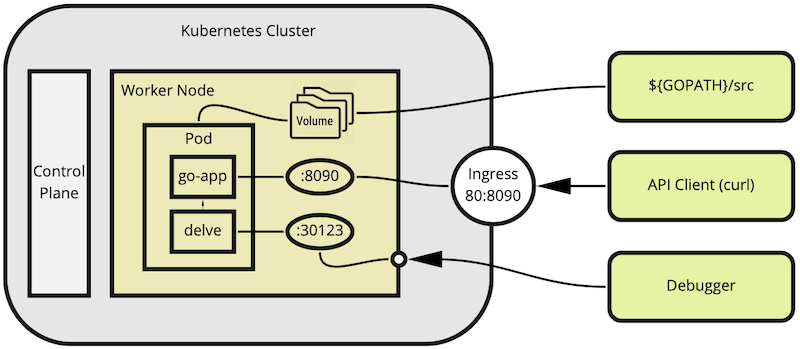
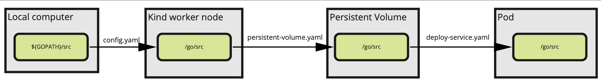
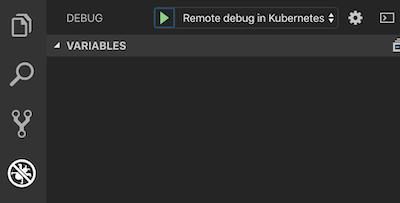
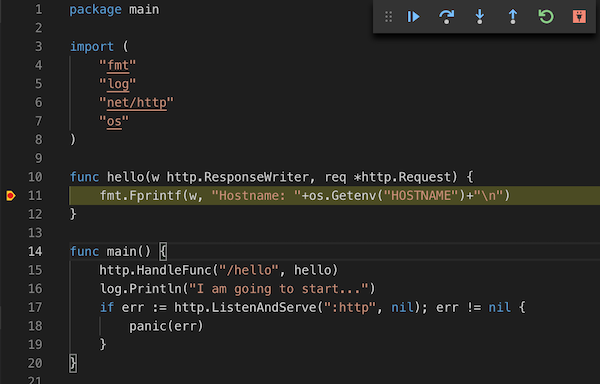

### Preface

In this article you are going to learn, how to remotely debug a go service in kubernetes. If you are a developer with an unusual power, your services have no dependencies to other services or all those dependencies are mocked in unit tests, you don't need to debug anything in kubernetes. All other developers need to setup debugging and they want to do it in the kubernetes environment as well. Let us share our exciting and painful experience with you now.

### Prerequisites

1. Docker Desktop: https://docs.docker.com/get-docker/

    Our version: 19.03.8
2. Kind (Kubernetes in Docker): https://kind.sigs.k8s.io. We decided to use kind instead of minikube, since it is a very good tool for testing kubernetes locally.

    Our version: v0.7.0
3. Kubectl: https://kubernetes.io/de/docs/tasks/tools/install-kubectl/

    Our version: 1.17.2
4. Visual Studio Code: https://code.visualstudio.com/download

    Our version: 1.32.3

### Big Picture

First, we are going to briefly explain, how it works:
* you need a docker container with delve started as a main process in it
* delve (Go debugger) must have an access to the folder with project files. That is done by mounting $GOPATH/src into the pod running in the kubernetes environment
* we start the delve server on the port 30123 and mount this port to the localhost, so that debugger can communicate with the server through it
* in order to trigger API functions we want to debug it is necessary to establish an ingress network. We use the port 8090 for that
    
All-in-all it will look like this picture demonstrates:
    


### Creating the Kubernetes cluster

#### Start the cluster

Before starting we need to adjust the cluster config file to your environment. Unfortunately, `kind` does not use the environment variables and we have to inject them into the config file with `sed`:

`sed -i.bak 's|'{GOPATH}'|'${GOPATH}'|g' cluster/config.yaml`

You can also open `cluster/config.yaml` and replace {GOPATH} with the absolute path manually:

    extraMounts:
        - hostPath: {GOPATH}/src

Assuming you already have installed kind (Kubernetes in Docker) on your local machine, the cluster is created by the following command:

`kind create cluster --config cluster/config.yaml --name=local-debug-k8s`

The cluster has the name `local-debug-k8s` and is created with the custom configuration (parameter `--config cluster/config.yaml`). Let us take a look at `cluster/config.yaml` and explain it:

```kind: Cluster
apiVersion: kind.x-k8s.io/v1alpha4
nodes:
- role: control-plane
  kubeadmConfigPatches:
  - |
    kind: InitConfiguration # necessary, since we are going to install an ingress network in the cluster
    nodeRegistration:
      kubeletExtraArgs:
        node-labels: "ingress-ready=true"
        authorization-mode: "AlwaysAllow"
  extraPortMappings:
  - containerPort: 80 # http endpoint of ingress runs on the port 80
    hostPort: 8090 # port on your host machine to call API's of the service
    protocol: TCP
  - containerPort: 30123 # node port for the delve server
    hostPort: 30123 # port on your host machine to communicate with the delve server
    protocol: TCP
- role: worker
  extraMounts:
    - hostPath: {GOPATH}/src # ATTENTION: you might want to replace this path with your ${GOPATH}/src manually
      containerPath: /go/src # path to the project folder inside the worker node
```

_Hint: make sure that ports 8090 and 30123 are free on your computer before you create the cluster_

Output:

    Creating cluster "local-debug-k8s" ...
    ✓ Ensuring node image (kindest/node:v1.17.0) 🖼
    ✓ Preparing nodes 📦 📦  
    ✓ Writing configuration 📜 
    ✓ Starting control-plane 🕹️ 
    ✓ Installing CNI 🔌 
    ✓ Installing StorageClass 💾 
    ✓ Joining worker nodes 🚜 
    Set kubectl context to "kind-local-debug-k8s"
    You can now use your cluster with:

    kubectl cluster-info --context kind-local-debug-k8s

    Have a nice day! 👋

Activate the kube-context, so that _kubectl_ can communicate with the newly created cluster:

`kubectl cluster-info --context kind-local-debug-k8s`

#### Install nginx-ingress

Source: https://kind.sigs.k8s.io/docs/user/ingress/#ingress-nginx

In order to make both port mounts working (8090 and 30123), it is necessary to deploy the nginx controller as well.
Run the following command for it:

`kubectl create -f https://raw.githubusercontent.com/kubernetes/ingress-nginx/master/deploy/static/provider/kind/deploy.yaml`

...and wait until nginx-controller runs:

`kubectl wait --namespace ingress-nginx --for=condition=ready pod --selector=app.kubernetes.io/component=controller --timeout=120s`

#### Labelling the worker node

We would suggest to label a worker node where the pod is going to be deployed: by default, a pod is deployed on one of several worker nodes you might have in the kind cluster. To make it work the docker image must be populated on all worker nodes in the cluster (it takes time). Otherwise, you can get into a situation, in which the pod is started on a node where the docker image is missing. Let's work with a dedicated node and safe the time.

So, we label a worker node with _debug=true_:

`kubectl label nodes local-debug-k8s-worker debug=true`

### Creating a docker image

Our service has only one `/hello` endpoint and writes just a few logs. The interesting part is in the Dockerfile:

```
FROM golang:1.13-alpine

ENV CGO_ENABLED=0 # compile gcc statically
ENV GOROOT=/usr/local/go
ENV GOPATH=${HOME}/go # this path will be mounted in deploy-service.yaml later
ENV PATH=$PATH:${GOROOT}/bin

EXPOSE 30123 # for delve
EXPOSE 8090 # for API calls

WORKDIR /go/src/github.com/setlog/debug-k8s # ATTENTION: you want to check, if the path to the project folder is the right one here

# Install delve, our version is 1.4.1
RUN apk update && apk add git && \
    go get github.com/go-delve/delve/cmd/dlv

# let start delve at the entrypoint
ENTRYPOINT ["/go/bin/dlv", "debug", ".", "--listen=:30123", "--accept-multiclient", "--headless=true", "--api-version=2"]
```

Build the docker image locally, first:

`docker build -t setlog/debug-k8s .`

Load the docker image into the node _local-debug-k8s-worker_

`kind load docker-image setlog/debug-k8s:latest --name=local-debug-k8s --nodes=local-debug-k8s-worker`

This message will be shown and it is just saying that the image was not there:

    Image: "setlog/debug-k8s:latest" with ID "sha256:944baa03d49698b9ca1f22e1ce87b801a20ce5aa52ccfc648a6c82cf8708a783" not present on node "local-debug-k8s-worker"

### Starting the delve server in the cluster

Now we want to create a persistent volume and its claim in order to mount the project path into the worker node:

`kubectl create -f cluster/persistent-volume.yaml`

The interesting part here is:

```
  hostPath:
    path: /go/src
```

Lets take a look at the full chain of mounting the local project path into the pod, since you want probably to adjust them to your environment:



Check, if your persistent volume claim has been successfully created (STATUS must be Bound):

`kubectl get pvc`

    NAME     STATUS   VOLUME   CAPACITY   ACCESS MODES   STORAGECLASS   AGE
    go-pvc   Bound    go-pv    256Mi      RWO            hostpath       51s

You are ready to start the service in the debug mode:

`kubectl create -f cluster/deploy-service.yaml`

Let's go through the deployment.

* Image name is what we loaded into the kind cluster with the command `kind load image...`. _imagePullPolicy_ must be set to _IfNotPresent_, because it is already loaded there and we don't want kubernetes to try doing it once more.

          image: setlog/debug-k8s:latest
          imagePullPolicy: IfNotPresent

* We use the persistent volume claim to mount the project path into the pod and make `/go/src` to be linked with `${GOPATH}/src` on your computer:

      containers:
        - name: debug-k8s
          ...
          volumeMounts:
            - mountPath: /go/src
              name: go-volume
      volumes:
        - name: go-volume
          persistentVolumeClaim:
            claimName: go-pvc

* As there might be several workers in your cluster, we deploy the pod on the one, that is labelled with _debug=true_. The docker image _setlog/debug-k8s_ has been loaded earlier in it already.

      nodeSelector:
        debug: "true"

* Service _service-debug_ has the type _NodePort_ and is mounted into the worker node. This port 30123 is equal to the parameter _--listen=:30123_ in the Dockerfile, what makes possible to send debug commands to the delve server.

* Service _debug-k8s_ will be connected to the ingress server in the final step. It serves for exposing the API endpoints we are going to debug.

If you did all steps correctly, your pod should be up and running. Check it with `kubectl get pod`. You should see the output with the pod status _Running_ and two additional services _debug-k8s_ and _service-debug_:

```
NAME                            READY   STATUS    RESTARTS   AGE
pod/debug-k8s-6d69b65cf-4fl6t   1/1     Running   0          1h

NAME                    TYPE        CLUSTER-IP     EXTERNAL-IP   PORT(S)           AGE
service/debug-k8s       ClusterIP   10.96.80.193   <none>        8090/TCP          1h
service/kubernetes      ClusterIP   10.96.0.1      <none>        443/TCP           1h
service/service-debug   NodePort    10.96.219.86   <none>        30123:30123/TCP   1h
```

_Hint: create a new variable to store the pod name. It can be helpful, if you repeatedly debug the pod_
        `PODNAME=$(kubectl get pod -o jsonpath='{.items[0].metadata.name}')`

Usualy it takes a couple of seconds to start the debugging process with delve. If your paths are mounted in the proper way, you will find the file `__debug_bin` in the project path on your computer. That is an executable which has been created by delve.

Also, you can output logs of the pod by performing `kubectl logs $PODNAME` in order to make sure that the delve API server is listening at 30123.

Output:

        API server listening at: [::]:30123

_Hint: always wait until this log message is shown for this pod before you start the debugging process. Otherwise the delve server is not up yet and cannot answer to the debugger_

### Starting the debug process via launch.json

Now we need a debug configuration in Visual Code. This can be done in `.vscode/launch.json`:

```
{
    "version": "0.2.0",
    "configurations": [
        {
            "name": "Remote debug in Kubernetes",
            "type": "go",
            "request": "attach",
            "mode":"remote",
            "remotePath": "/go/src/github.com/setlog/debug-k8s", // path to the project path inside the pod
            "port": 30123, // local port to send the debug commands to
            "host": "127.0.0.1", // host to send the debug commands to
            "showLog": true
        }
    ]
}
```

You find the new configuration in Visual Code here:



After starting the debug process there is a new log created by the go service:

    2020/05/28 15:38:53 I am going to start...

We are ready to debug, but we have to trigger the API functions through the ingress service. Deploy it with kubectl:

`kubectl create -f cluster/ingress.yaml`

...and try it now:

`curl http://localhost:8090/hello`

Here you go:



Happy debugging!

### Cleaning up

If you don't need your kind cluster anymore, it can be removed with following command:

`kind delete cluster --name=local-debug-k8s`
